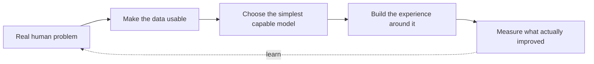

<!-- Profile repository: github.com/dharmik-21/dharmik-21 -->
<svg xmlns="http://www.w3.org/2000/svg" viewBox="0 0 1600 390" role="img" aria-labelledby="title desc">
  <title id="title">Dharmik Barot - AI / ML Engineer</title>
  <desc id="desc">A dark futuristic banner with animated orbital lines around a glowing AI core.</desc>
  <defs>
    <linearGradient id="bg" x1="0" x2="1" y1="0" y2="1"><stop stop-color="#070b14"/><stop offset=".5" stop-color="#0d1b2a"/><stop offset="1" stop-color="#062c31"/></linearGradient>
    <radialGradient id="core"><stop stop-color="#e6fffb"/><stop offset=".18" stop-color="#5eead4"/><stop offset=".5" stop-color="#0d9488" stop-opacity=".55"/><stop offset="1" stop-color="#0d9488" stop-opacity="0"/></radialGradient>
    <filter id="glow"><feGaussianBlur stdDeviation="8" result="b"/><feMerge><feMergeNode in="b"/><feMergeNode in="SourceGraphic"/></feMerge></filter>
    <pattern id="grid" width="42" height="42" patternUnits="userSpaceOnUse"><path d="M42 0H0V42" fill="none" stroke="#5eead4" stroke-opacity=".07"/></pattern>
  </defs>
  <rect width="1600" height="390" fill="url(#bg)"/><rect width="1600" height="390" fill="url(#grid)"/>
  <g transform="translate(1225 194)" fill="none" stroke="#5eead4" stroke-opacity=".42">
    <ellipse rx="275" ry="85" stroke-width="1.5" transform="rotate(-22)"><animateTransform attributeName="transform" type="rotate" from="-22 0 0" to="338 0 0" dur="25s" repeatCount="indefinite"/></ellipse>
    <ellipse rx="210" ry="64" stroke-width="1" transform="rotate(48)"><animateTransform attributeName="transform" type="rotate" from="48 0 0" to="-312 0 0" dur="19s" repeatCount="indefinite"/></ellipse>
    <circle r="122" stroke="#2dd4bf" stroke-opacity=".25"/><circle r="86" stroke="#5eead4" stroke-opacity=".22"/>
  </g>
  <g transform="translate(1225 194)"><circle r="124" fill="url(#core)" filter="url(#glow)"><animate attributeName="r" values="116;132;116" dur="3.8s" repeatCount="indefinite"/></circle><circle r="13" fill="#e6fffb"/><circle r="5" fill="#0f766e"/></g>
  <g fill="#5eead4" filter="url(#glow)"><circle cx="1010" cy="118" r="4"><animate attributeName="opacity" values=".2;1;.2" dur="2.1s" repeatCount="indefinite"/></circle><circle cx="1445" cy="91" r="3"><animate attributeName="opacity" values="1;.2;1" dur="3s" repeatCount="indefinite"/></circle><circle cx="1512" cy="282" r="4"><animate attributeName="opacity" values=".3;1;.3" dur="2.6s" repeatCount="indefinite"/></circle></g>
  <g fill="#e2e8f0" font-family="Arial, Helvetica, sans-serif"><text x="112" y="146" font-size="20" letter-spacing="7" fill="#5eead4">AI / ML ENGINEER</text><text x="108" y="224" font-size="72" font-weight="700" letter-spacing="-2">DHARMIK BAROT</text><text x="112" y="270" font-size="19" fill="#94a3b8" letter-spacing="1">BUILDING INTELLIGENCE WITH INTENT</text></g>
  <path d="M112 301h450" stroke="#2dd4bf" stroke-opacity=".42"/><circle cx="112" cy="301" r="4" fill="#5eead4"/>
</svg>

<div align="center">
  
</div>

<br />

```text
SYSTEM / DHARMIK.BAROT
LOCATION / BENGALURU, INDIA
MODE     / MAKING AI USEFUL IN THE PHYSICAL WORLD
STATUS   / BUILDING · LEARNING · SHIPPING
```

> **Welcome.** I am Dharmik - an AI/ML engineer who likes the moment an idea stops being a model and starts helping someone.

<div align="center">
  <a href="https://www.linkedin.com/in/barot-dharmik2105"></a>
  <a href="mailto:dharmik.aieng@gmail.com"></a>
  
</div>

---

## The work I want to be known for

<table>
<tr>
<td width="42%" valign="top">

### 01 / See for someone else
**Cortex Lens** is an AI-powered assistive glasses system for people with visual impairments.

It recognizes objects, estimates their distance, reads a page aloud, and turns urgent information into immediate voice feedback - all in a compact Raspberry Pi system.

`YOLOv8` `MiDaS` `PyTorch` `EasyOCR` `OpenCV` `Raspberry Pi`

</td>
<td width="58%" valign="top">

```text
camera ──► vision model ──► depth + priority
                                  │
          tactile control ◄───────┤
                                  ▼
                         human-first feedback
                         (voice / audio / touch)
```

</td>
</tr>
</table>

<table>
<tr>
<td width="58%" valign="top">

```text
messy invoice image
        │
        ▼
OCR → structured GST data → useful answers
                              │
                              ▼
                       decisions, not spreadsheets
```

</td>
<td width="42%" valign="top">

### 02 / Make data answer back
**Hisab AI** turns invoice images into financial clarity.

OCR, NLP, dashboards, and a chat interface work together so users can ask about sales, profits, and their best-selling products in plain language.

`Tesseract` `Pandas` `Plotly` `MySQL` `Streamlit` `NLP`

</td>
</tr>
</table>

<table>
<tr>
<td width="42%" valign="top">

### 03 / Find the signal in the storm
**CycloneVision AI** explores one-class detection for satellite imagery with autoencoders, CNN localization, and a real-time dashboard.

`TensorFlow` `Autoencoders` `CNN` `OpenCV`

</td>
<td width="58%" valign="top">

### 04 / Give language an interface
**Blog Generator AI** uses LangChain and NLP to turn a topic into structured, controllable content - a small experiment in human + LLM co-creation.

`LangChain` `LLMs` `Transformers` `Streamlit`

</td>
</tr>
</table>

---

## My operating system



I work across **machine learning, deep learning, NLP, computer vision, RAG, LLM applications, agentic workflows, and multimodal AI**. I also build the product around the intelligence - not just the notebook.

<details>
<summary><b>Open the toolbox</b></summary>
<br />

| AI & data | Product engineering | Ship it |
| :-- | :-- | :-- |
| Python · PyTorch · TensorFlow · Scikit-learn · Hugging Face · LangChain · OpenCV · Pandas | **MERN**: MongoDB · Express · React · Node.js · JavaScript · HTML · CSS | FastAPI · Streamlit · MySQL · Docker · Git · Jupyter |

</details>

---

## A note from the lab

I am currently completing an **MCA in Artificial Intelligence & Machine Learning** at Jain University (2024-2026). I have also published research on **Multimodal AI in business decision-making**, with a particular interest in ethical deployment, bias mitigation, and interpretable systems.

<div align="center">

### Building something thoughtful with AI?

**[Send a signal](mailto:dharmik.aieng@gmail.com)** &nbsp;·&nbsp; **[Connect on LinkedIn](https://www.linkedin.com/in/barot-dharmik2105)**

<sub>Made in Bengaluru. Curious everywhere.</sub>

</div>
