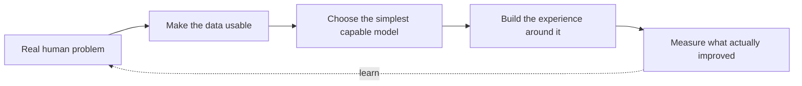

```text
SYSTEM / DHARMIK.BAROT
LOCATION / BENGALURU, INDIA
MODE     / MAKING AI USEFUL IN THE PHYSICAL WORLD
STATUS   / BUILDING · LEARNING · SHIPPING
```

> **Welcome.** I am Dharmik - an AI/ML engineer who likes the moment an idea stops being a model and starts helping someone.

<div align="center">
  <a href="https://www.linkedin.com/in/barot-dharmik2105"></a>
  <a href="mailto:dharmik.aieng@gmail.com"></a>
  
</div>

---

## The work I want to be known for

<table>
<tr>
<td width="42%" valign="top">

### 01 / See for someone else
**Cortex Lens** is an AI-powered assistive glasses system for people with visual impairments.

It recognizes objects, estimates their distance, reads a page aloud, and turns urgent information into immediate voice feedback - all in a compact Raspberry Pi system.

`YOLOv8` `MiDaS` `PyTorch` `EasyOCR` `OpenCV` `Raspberry Pi`

</td>
<td width="58%" valign="top">

```text
camera ──► vision model ──► depth + priority
                                  │
          tactile control ◄───────┤
                                  ▼
                         human-first feedback
                         (voice / audio / touch)
```

</td>
</tr>
</table>

<table>
<tr>
<td width="58%" valign="top">

```text
messy invoice image
        │
        ▼
OCR → structured GST data → useful answers
                              │
                              ▼
                       decisions, not spreadsheets
```

</td>
<td width="42%" valign="top">

### 02 / Make data answer back
**Hisab AI** turns invoice images into financial clarity.

OCR, NLP, dashboards, and a chat interface work together so users can ask about sales, profits, and their best-selling products in plain language.

`Tesseract` `Pandas` `Plotly` `MySQL` `Streamlit` `NLP`

</td>
</tr>
</table>

<table>
<tr>
<td width="42%" valign="top">

### 03 / Find the signal in the storm
**CycloneVision AI** explores one-class detection for satellite imagery with autoencoders, CNN localization, and a real-time dashboard.

`TensorFlow` `Autoencoders` `CNN` `OpenCV`

</td>
<td width="58%" valign="top">

### 04 / Give language an interface
**Blog Generator AI** uses LangChain and NLP to turn a topic into structured, controllable content - a small experiment in human + LLM co-creation.

`LangChain` `LLMs` `Transformers` `Streamlit`

</td>
</tr>
</table>

---

## My operating system



I work across **machine learning, deep learning, NLP, computer vision, RAG, LLM applications, agentic workflows, and multimodal AI**. I also build the product around the intelligence - not just the notebook.

<details>
<summary><b>Open the toolbox</b></summary>
<br />

| AI & data | Product engineering | Ship it |
| :-- | :-- | :-- |
| Python · PyTorch · TensorFlow · Scikit-learn · Hugging Face · LangChain · OpenCV · Pandas | **MERN**: MongoDB · Express · React · Node.js · JavaScript · HTML · CSS | FastAPI · Streamlit · MySQL · Docker · Git · Jupyter |

</details>

---

## A note from the lab

I am currently completing an **MCA in Artificial Intelligence & Machine Learning** at Jain University (2024-2026). I have also published research on **Multimodal AI in business decision-making**, with a particular interest in ethical deployment, bias mitigation, and interpretable systems.

<div align="center">

### Building something thoughtful with AI?

**[Send a signal](mailto:dharmik.aieng@gmail.com)** &nbsp;·&nbsp; **[Connect on LinkedIn](https://www.linkedin.com/in/barot-dharmik2105)**

<sub>Made in Bengaluru. Curious everywhere.</sub>

</div>
